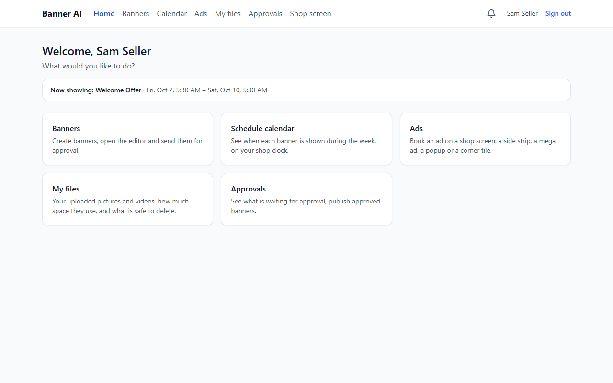
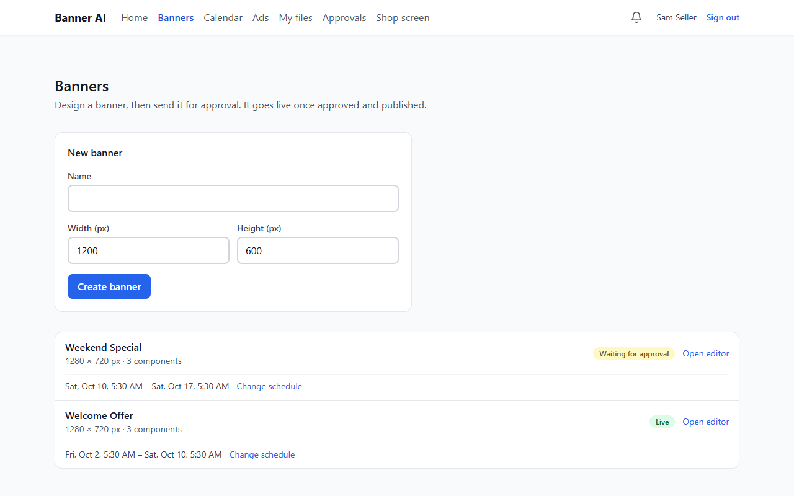
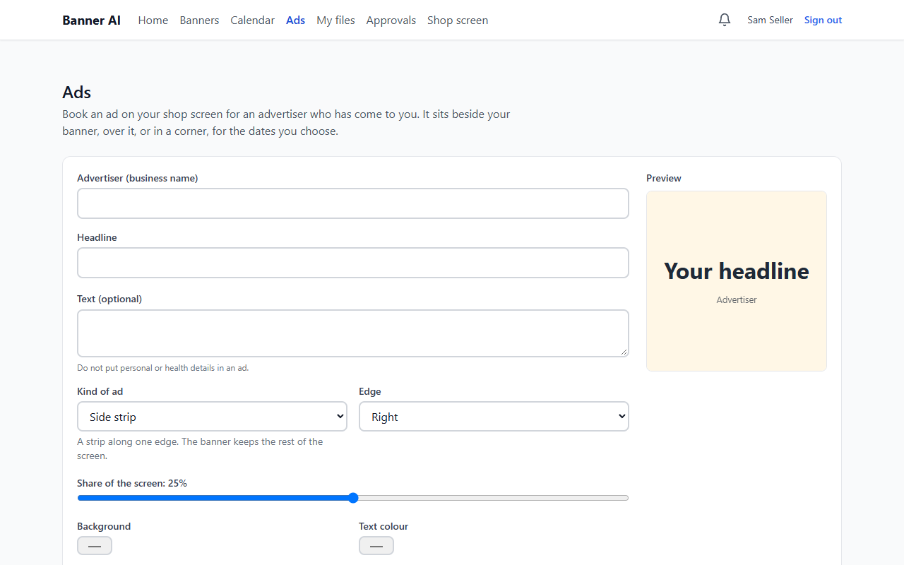
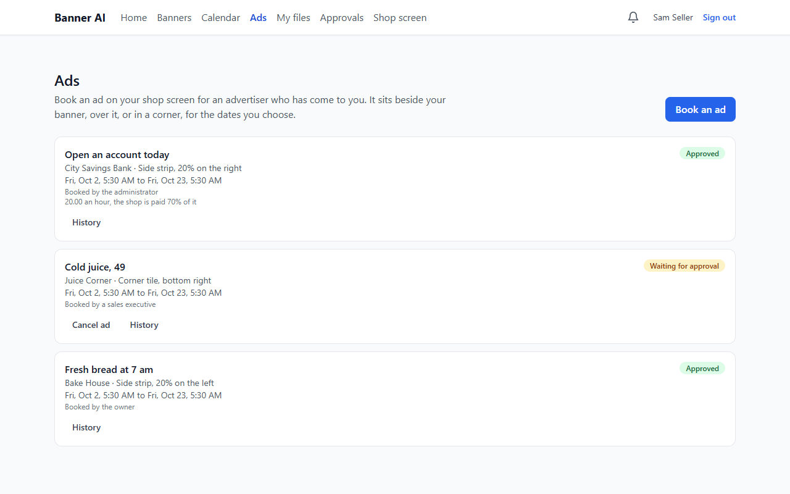

# Sales executive walkthrough (about 15 minutes)

You are **Sam**, you work for Olivia at **Sunrise Cafe**. You make banners and book ads; **Olivia approves** them. You will make a banner, send it in, book an ad and see what you
can and cannot do.

Sign in at <http://localhost:3000> with `demo-seller@bannerai.demo` / `Demo-Seller-2026!`.
(New to the demo? Start with [DEMO_START_HERE.md](../../DEMO_START_HERE.md).)

---

## Step 1. Home
You land on **Home**. The menu is shorter than the owner's: *Banners, Calendar, Ads, My files, Approvals, Shop screen*. You do not see *Team*, *Subscription* or *My shop*:
those are the owner's.

> First thing in real life: click your name (top right) and **change the password** you were given.

## Step 2. Your banners
Click **Banners**. *Weekend Special* is yours: it says *Waiting for approval*. Olivia has to approve it before it can run. You can still open it, but changing its schedule sends
it back for approval.

## Step 3. Make a new banner
1. Under **Create banner** type a name, for example `Monday Coffee Deal`. Width 1280 and height 720 suit most TVs. Click **Create banner**.
2. Click **Open editor**.
3. Click **Text** on the left: a text box appears. Click it and type your words in **Content** in the right panel; change size and colour there too.
4. Click **Shape** for a coloured background block; use the **Z-Index** number in the panel to put it behind the text (smaller number = further back).
5. Click **Image** and **Choose from my files** (or upload one) to add a picture.
6. Press **Save**. **Preview** shows how it will play.

## Step 4. Say when it should run
Back on **Banners**, click **Set schedule** under your new banner: choose a start and an end (the shop's clock). Optionally *Only at certain hours each day* and the days.
If it overlaps another banner, BannerAI tells you which and you change the hours.

## Step 5. Send it for approval
Click **Submit for approval**. Olivia gets a message in her bell. Your banner shows *Waiting for approval*; later it shows **Approved** or **Rejected** with her reason
(then you fix it and submit again).

## Step 6. The calendar
Click **Calendar** to see the week: your banners and everyone's, so you can plan around them.

## Step 7. Book an ad for a customer
Someone asks you to advertise their business on the shop screen. Click **Ads → Book an ad**.
1. **Advertiser**: their business name. **Headline**: the big words. Add a short text if you like.
2. Choose the **kind** and where it goes; the **preview** shows the result.
3. Choose the dates, **Save as draft**, then **Send in**.
4. It shows *Waiting for approval*: Olivia decides. You can change an ad that is still a draft or was sent back; an approved ad can only be cancelled.

**Rules to remember**
- No phone numbers, e-mail addresses, card or ID numbers in ads: BannerAI refuses them.
- Words about health or patients make the administrator review the ad first.
- If the screen is already busy at that time BannerAI says which ad is in the way.

## Step 8. See all the shop's ads
**Ads** shows what is booked on the screen (so you can find a free time). You see yours, and everyone's that is approved or waiting.

## Step 9. Messages
The **bell** tells you when Olivia approves or sends back something of yours. Click the message to go to it.

## Step 10. The shop screen
**Shop screen** plays what is live in the shop. Open it on a TV or a second window.

---

## What you cannot do (by design)
| You cannot | Who can |
|---|---|
| Approve or publish banners | Olivia (or an approver she chose) |
| Change the plan, the team or the shop's details | Olivia |
| See the monthly money statement | Olivia and the administrator |

Read the [Sales Executive Guide](../../BANNER_CREATOR_USER_GUIDE.md) for every detail.
