# Administrator walkthrough (about 30 minutes)

You are the **administrator**: you look after all shops, their plans, the places, the prices of ads and anything that needs a decision.

Sign in at <http://localhost:3000> with `demo-admin@bannerai.demo` / `Demo-Admin-2026!`.
(New to the demo? Start with [Start here](../start-here.md).)

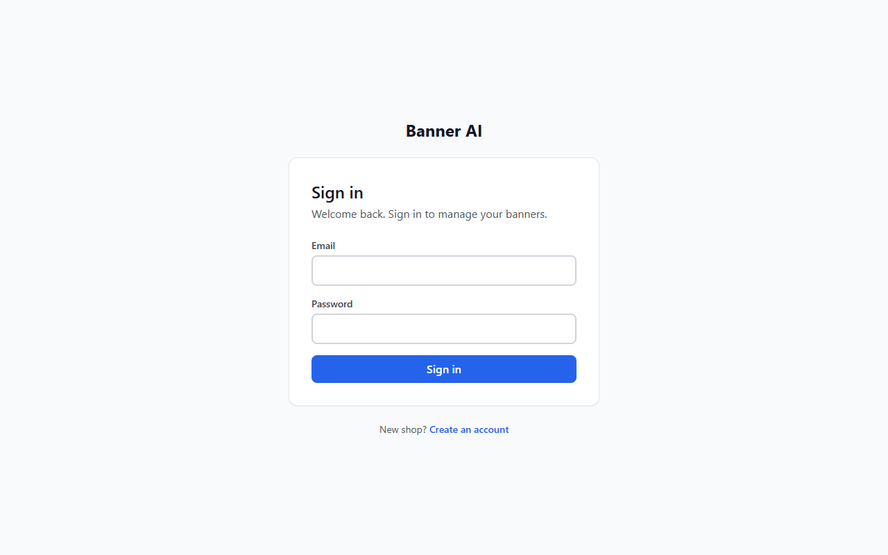

---

## Step 1. Home and the menu
The menu: *Home, Ads, Takeover, Shops, Places, Ad rates, Ad report, Plans, Subscriptions, Users, Activity*. The bell is yours too.

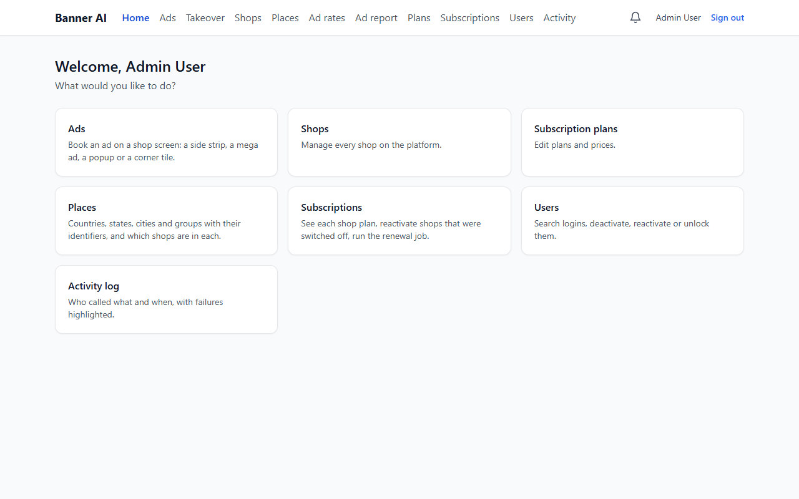

## Step 2. Users
Click **Users**. Every login with its shop. You can **Deactivate / Activate**, **Unlock** (a login locks after five wrong passwords), **Move** a sales executive to another shop,
and **Make owner** (makes a member of a shop its owner). Click an e-mail address to see that person's **activity**.

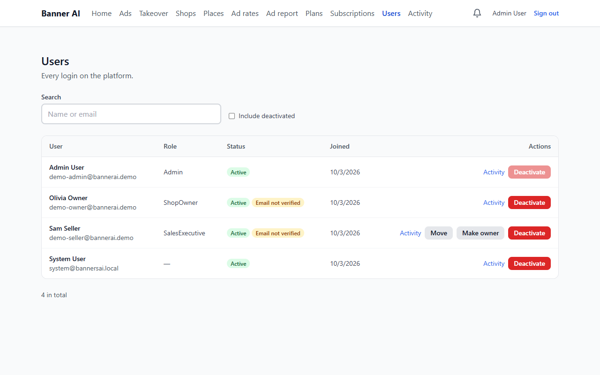

## Step 3. Subscriptions
Click **Subscriptions**. Each shop's plan, status and renewal date. Use the filter for *Grace period* or *Expired*. **Run lifecycle now** applies reminders, grace and expiry at once
(it also runs by itself every day). A shop whose plan has ended cannot sign in; its screen keeps the default board.

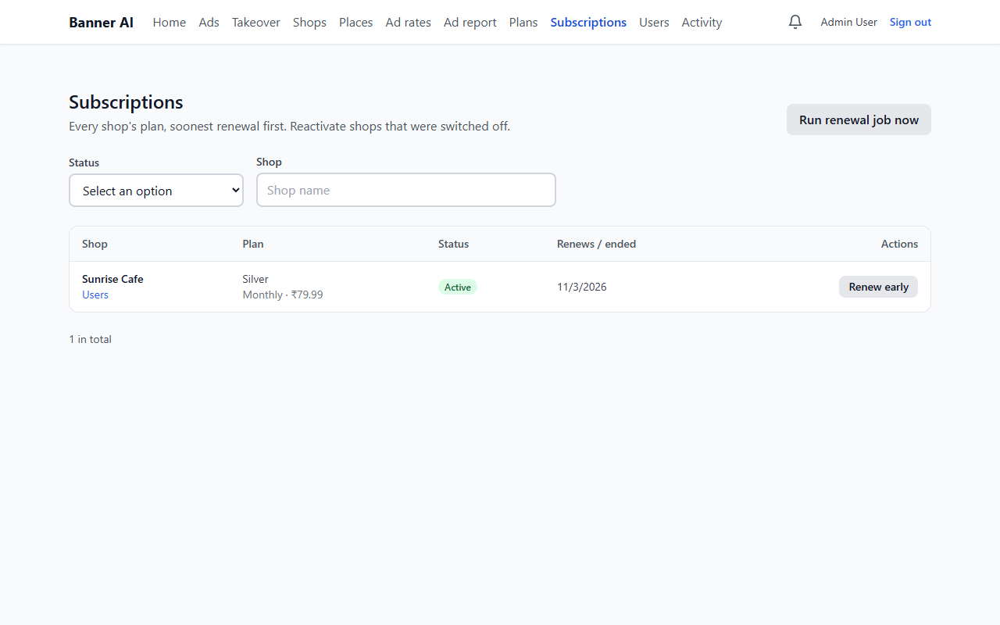

## Step 4. Plans
Click **Plans**. Basic, Silver, Gold, Platinum: monthly and yearly price, number of banners, shops and users, and **storage**. Change a price or a limit here.

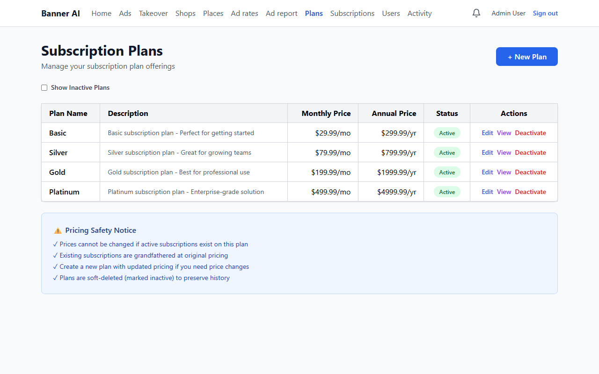

## Step 5. Places
Click **Places**. Click **India**, then **Maharashtra**, then **Mumbai**: you see its **groups** (Andheri). Add, rename or switch off places; a place that has shops cannot be deleted.
Set a **time zone** on a country or city: shops follow it unless they set their own.

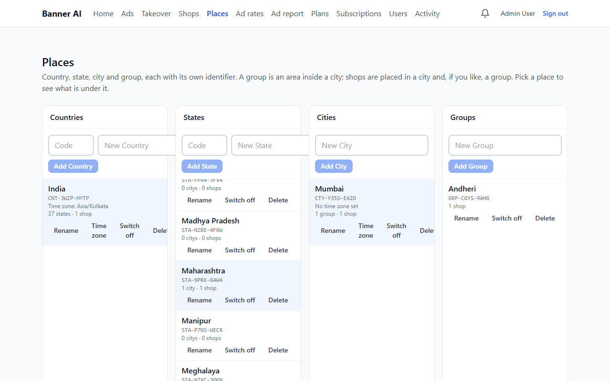

## Step 6. Ad prices
Click **Ad rates**. One rate exists: *every shop, every kind, 100 an hour, 70% paid to the shop*.
1. Click **Add a rate**.
2. Choose where it applies (empty = every shop; or a country, state, city), the kind of ad, the **price for one hour** and the **shop's share**.
3. The **narrowest place wins**: a Mumbai rate beats an India rate. Side and mega ads are priced for the whole screen and cut down to the share they take.

An ad you book cannot be sent in until a rate covers its shop.

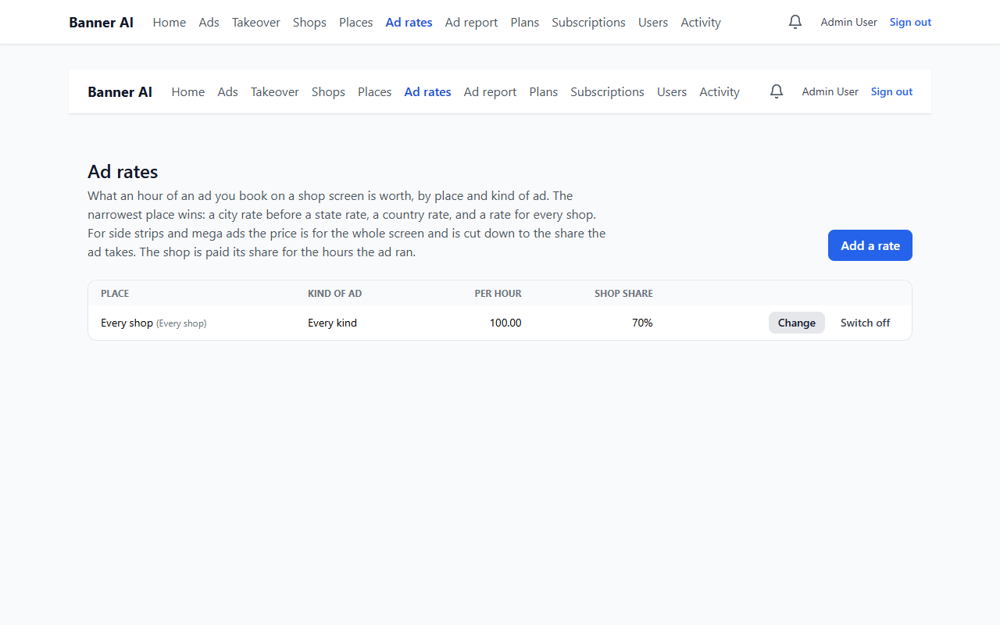

## Step 7. Book an ad on a shop
Click **Ads**, choose **Sunrise Cafe** in the *Shop* list. You see **every** ad on that shop, including the owner's and the executive's (marked "Booked by…"), so you can plan around them.
Click **Book an ad**, fill it in, **Save as draft**, **Send in**: yours are approved at once, the owner is told, and the price is fixed from the rate.

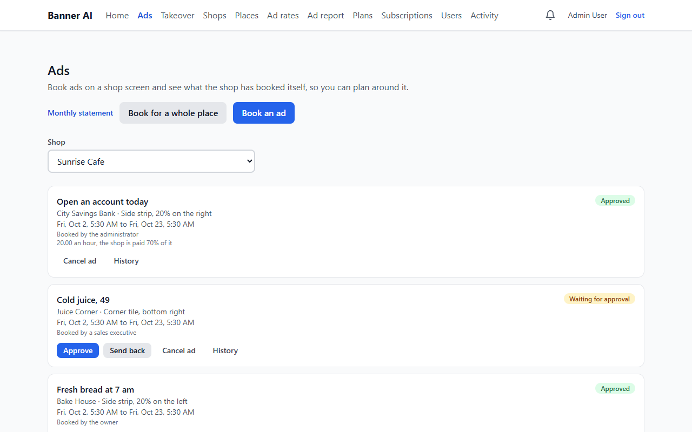

## Step 8. Book one ad on a whole city
Click **Book for a whole place**, choose **Mumbai**, fill in the ad and press **Book on all these shops**. BannerAI books each shop at its own rate and lists the shops where the ad could
not go and why (screen already taken, no rate).

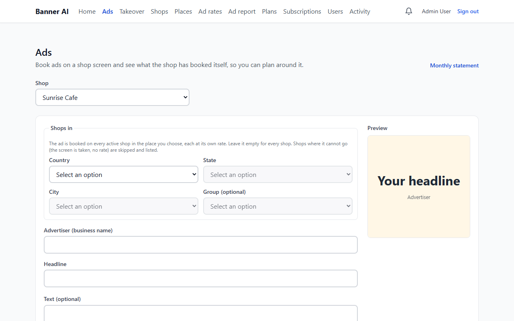

## Step 9. The compliance check (try it)
1. **Book an ad** for Sunrise Cafe with the headline `Call 9876543210 now`. It is **refused**: ads must not carry personal details.
2. Change it to `Free flu shots for every patient`, save it, send it in. It says it needs a **compliance review** and waits.
3. Open **Ads** again: the ad shows *Waiting for compliance review* with the reason. Click **Approve** (or **Send back** with a reason). **History** records who decided and when.

## Step 10. Money
Click **Ads → Monthly statement**. For each shop: hours every ad ran, and for your ads what the shop is **paid** (hours × price × share). Choose a month or one shop; the city totals show above.

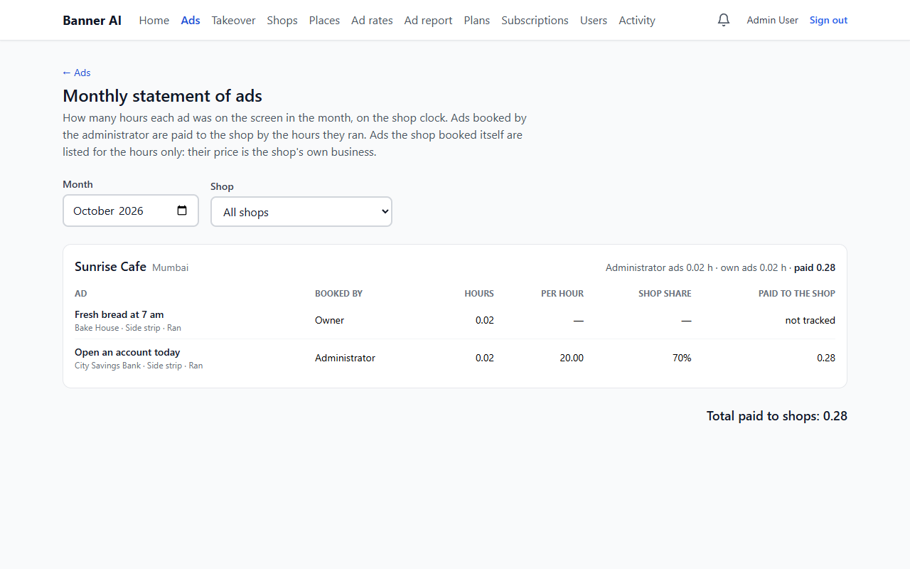

## Step 11. Who booked what
Click **Ad report**: for the month, how many ads each person booked, went live, were sent back or cancelled, are waiting, and how many were held for review.

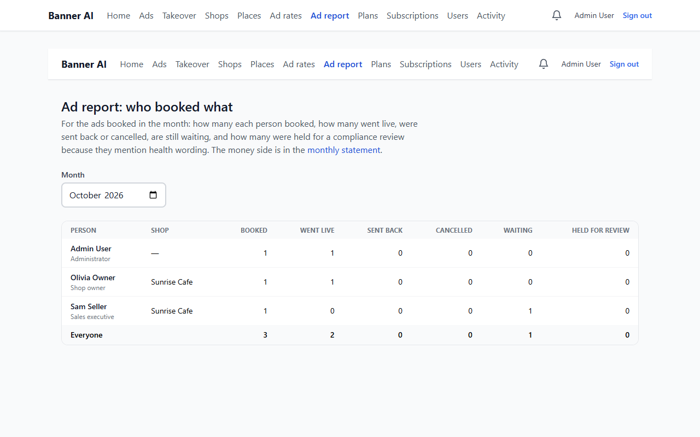

## Step 12. Takeovers
Click **Takeover**. When a shop changes hands the new owner asks and the old owner agrees. If the old owner cannot be reached you can **Confirm for the owner** with a written reason.
Be careful: the old shop's logins are switched off and its plan stops renewing.

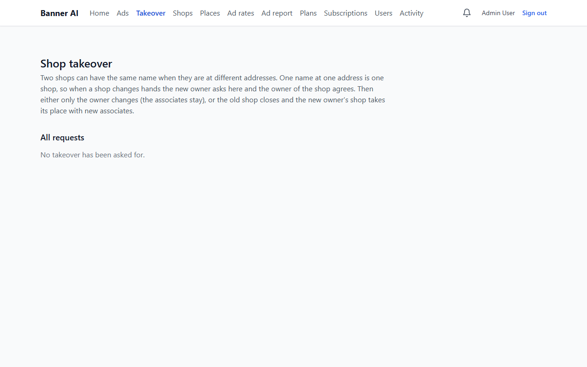

## Step 13. Activity and export
Click **Activity**: who called what, newest first. Filter by dates, user, shop or failures only. **Export as CSV** downloads the same entries (kept six years by default).

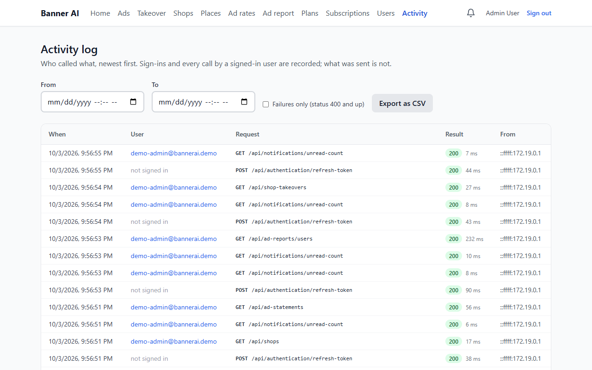

## Step 14. Messages
The bell tells you when an ad needs a review, when an owner overrides one of your ads, and when a shop changes hands.

---

## After the demo
- For real use, create your own administrator: `docker compose run --rm api --create-admin you@yourcompany.com "<a long password>"` and **do not run the demo script** on the real database.
- To go live (e-mail, texts, payments, cloud) follow [Providers setup guide](../../operations/providers-setup.md).
- The full [Administrator Guide](../admin.md) has every detail, and [deployment guide](../../operations/deployment.md) explains running it for real.
