# Shop owner walkthrough (about 25 minutes)

You are **Olivia**, you run **Sunrise Cafe**. You will look at what is running, approve what Sam made, change a banner, book an ad and learn where everything is.

Sign in at <http://localhost:3000> with `demo-owner@bannerai.demo` / `Demo-Owner-2026!`.
(New to the demo? Start with [Start here](../start-here.md).)

---

## Step 1. The Home page: your map
After signing in you land on **Home**. Every card is a place you can go; the same places are in the menu at the top: *Banners, Calendar, Ads, My files, Approvals, Team,
Subscription, My shop, Default board, Takeover, Shop screen*.

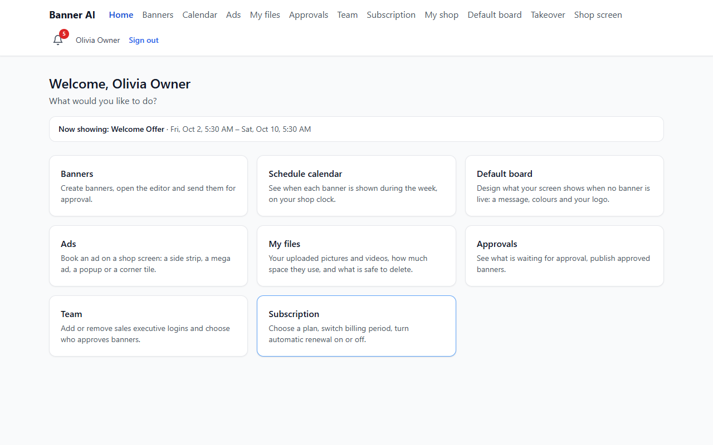

**The bell** next to your name shows how many messages you have not read. Sam has already sent you things to look at (a banner and an ad).

## Step 2. See what your customers see: the Shop screen
Click **Shop screen** in the menu (or open <http://localhost:3000/display>). This is what plays on the TV in the shop.
The banner **Welcome Offer** is in the middle, and two **ads** sit at the sides: *Fresh bread at 7 am* (yours) and *Open an account today* (booked by the administrator).
Move the mouse to see the **Full screen** button. Press the browser's back button to return.

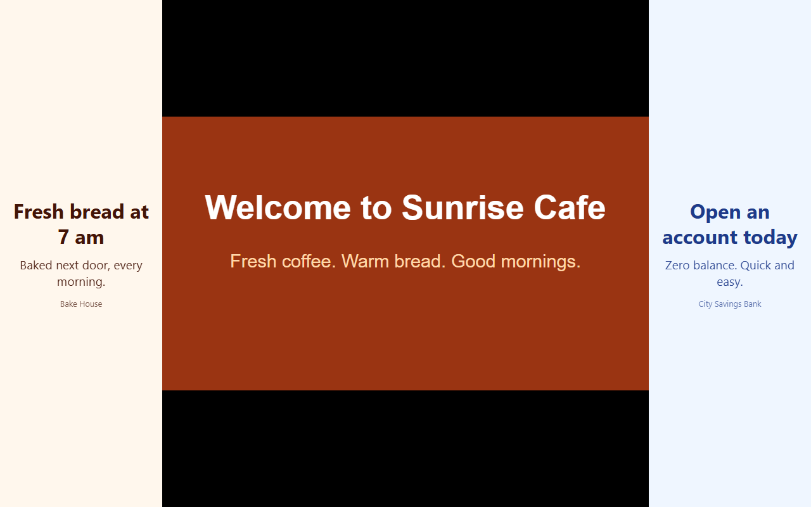

## Step 3. Your banners
Click **Banners**. You see **Welcome Offer** (approved, live) and **Weekend Special** (made by Sam, *Waiting for approval*). Under each banner is when it runs.

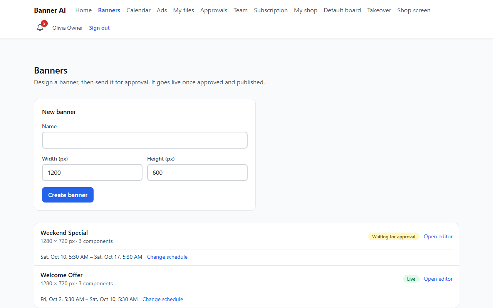

## Step 4. Change a banner in the editor
Click **Open editor** next to *Welcome Offer*.
1. Click the big white text. The **Properties** panel opens on the right.
2. Change its words: find **Content** in the panel (scroll down) and type a new greeting.
3. Drag the text to move it (it snaps to a grid); drag a corner to resize it. A click without moving does not move it.
4. Add something: click **Text**, **Image**, **Video** or **Shape** on the left.
5. Press **Save** (or Ctrl+S). **Preview** plays it as the screen will; the arrows undo and redo.

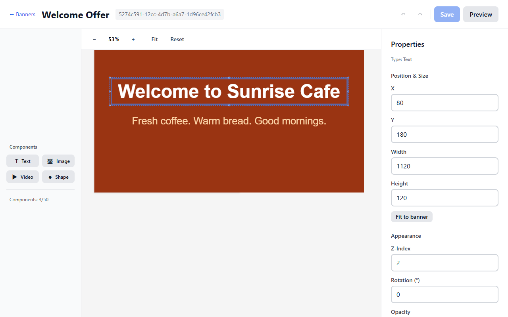

> A banner that is already approved goes back for approval if you change its schedule, so changing only the picture or words is the safe way to practise.
> Click **← Banners** to leave.

## Step 5. Set when a banner runs
On the banners page click **Change schedule** under *Weekend Special*.
- Choose a start and an end. **Times are your shop's clock**, not your computer's.
- Tick **Only at certain hours each day** to run for example 12:00 to 15:00, and choose the days of the week.
- If another banner already runs at that time BannerAI says which one: two banners cannot play at the same moment.

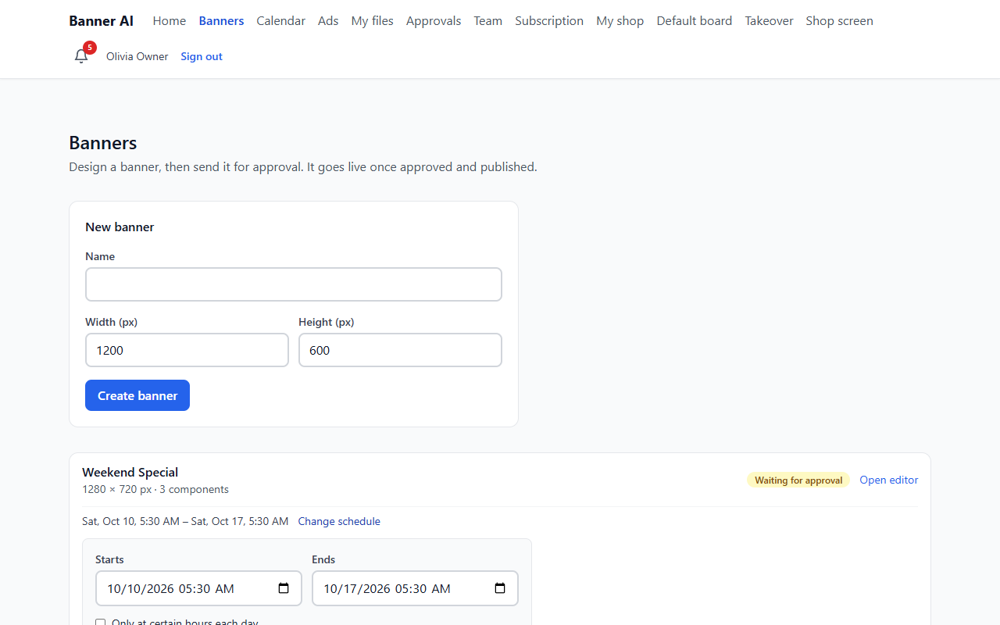

## Step 6. The calendar
Click **Calendar**. A week as blocks: Monday to Sunday, hours down the side. Faded blocks are not approved yet. Use *Next week* to look ahead.

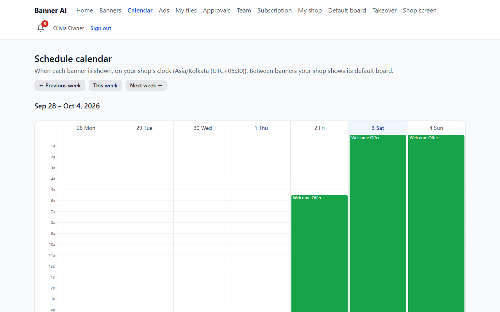

## Step 7. Approve Sam's banner
Click **Approvals**. *Weekend Special* is waiting for you.
1. Read what it is and when it will run.
2. Click **Approve** (or **Reject** and write why).
3. Click **Publish**. It will start when its schedule says.

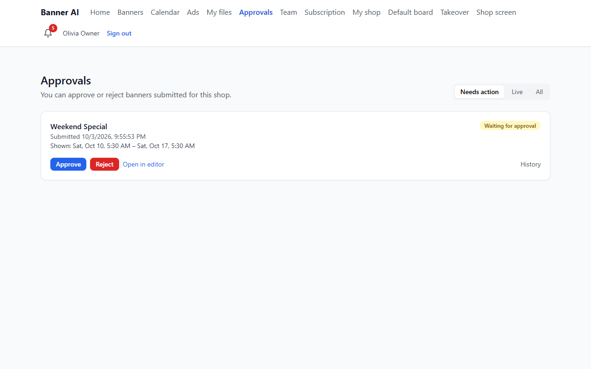

## Step 8. Ads on your screen
Click **Ads**. You see the three ads. *Cold juice, 49* was booked by Sam and waits for you: click **Approve**.
*Open an account today* was booked by the administrator: you cannot change it, but you may **Override this ad** if a local advertiser pays you more for that time (it stops
at once, you are still paid for the hours it ran, and the administrator is told). **History** shows who did what and when for any ad.

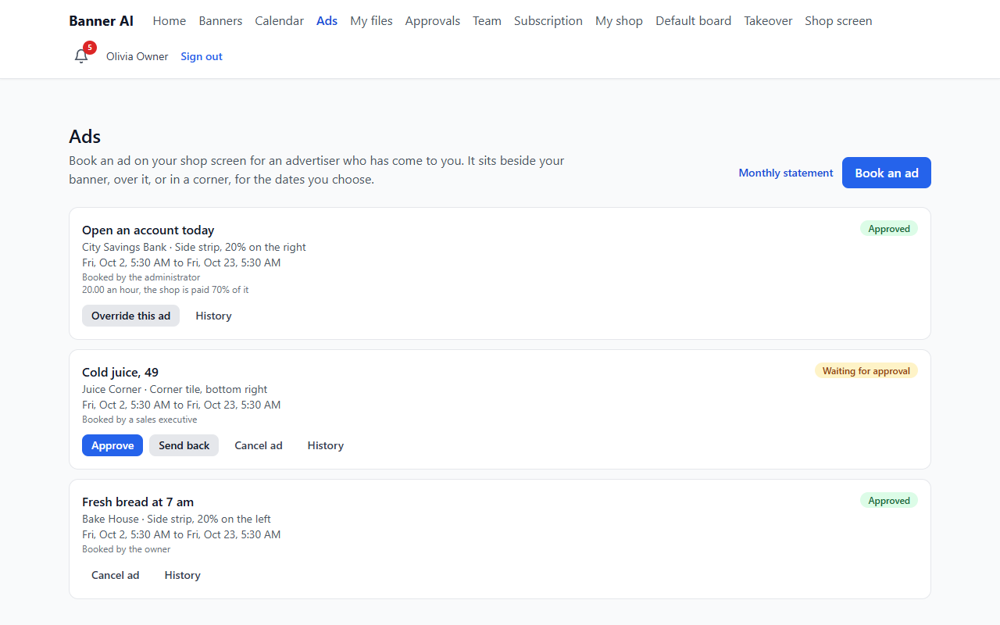

## Step 9. Book an ad yourself
Click **Book an ad**.
1. Type the advertiser's **business name** and a **headline** (and a short text).
2. Choose the **kind**: *Side strip* (a band along one edge), *Mega ad* (most of the screen), *Popup* (appears for a few seconds now and then), *Small corner tile*.
3. Choose the edge or corner, and for a strip how much of the screen it takes. The **preview** on the right shows it.
4. Choose when it runs, then **Save as draft**, then **Send in**. Your own ads are booked straight away.

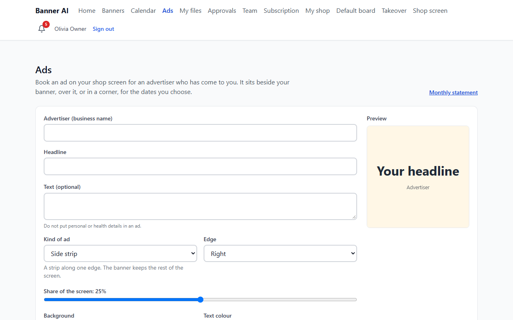

Try typing a phone number in the headline: BannerAI **refuses** it. Ads must not carry personal details. Words about health ("patients") send the ad to the administrator to look at first.

## Step 10. Money from the administrator's ads
Click **Ads → Monthly statement**. For the month it lists the hours each ad ran on your screen and what **you are paid** for the administrator's ads. Your own ads show
hours only: you set your own prices and BannerAI does not track what advertisers pay you.

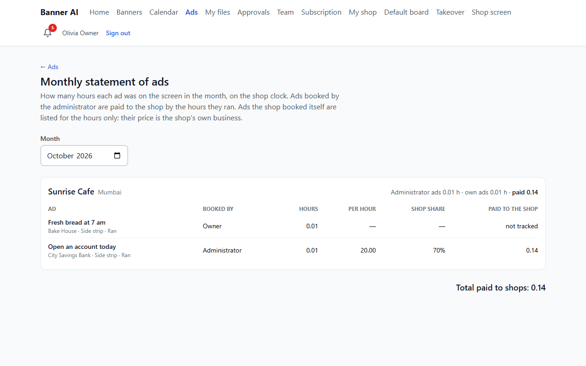

## Step 11. Your team
Click **Team**. You can add up to **two sales executives** and choose **who approves** banners (you, and/or an executive). Use *Hand the shop over* only when you really leave.

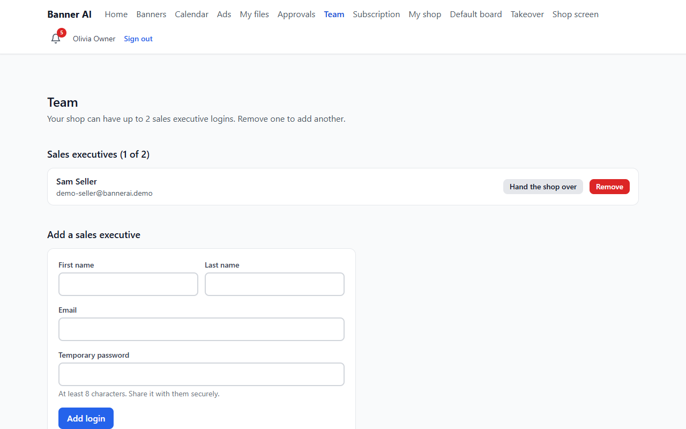

## Step 12. Your files
Click **My files**. Upload pictures and videos here once, use them in banners and ads. The bar shows how much of your plan's storage you used; a file in use cannot be deleted.

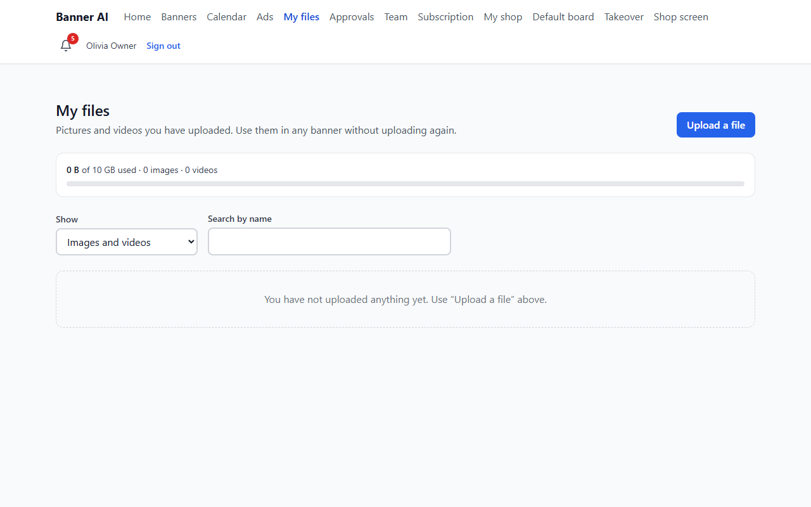

## Step 13. The default board
Click **Default board**. This is what the screen shows when no banner is live. Change the message, colours and add your logo (from My files); the preview shows it.

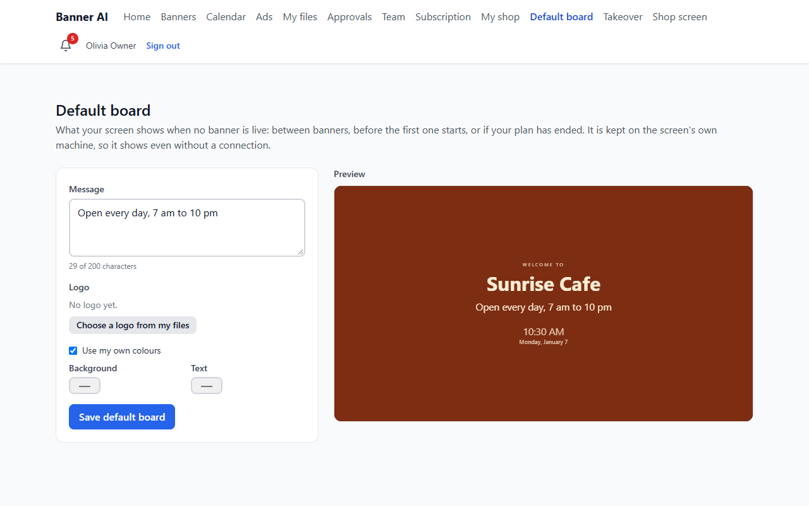

## Step 14. Your plan
Click **Subscription**. Your plan, price and renewal date. (Paying online is not connected in the demo: see the providers guide.)

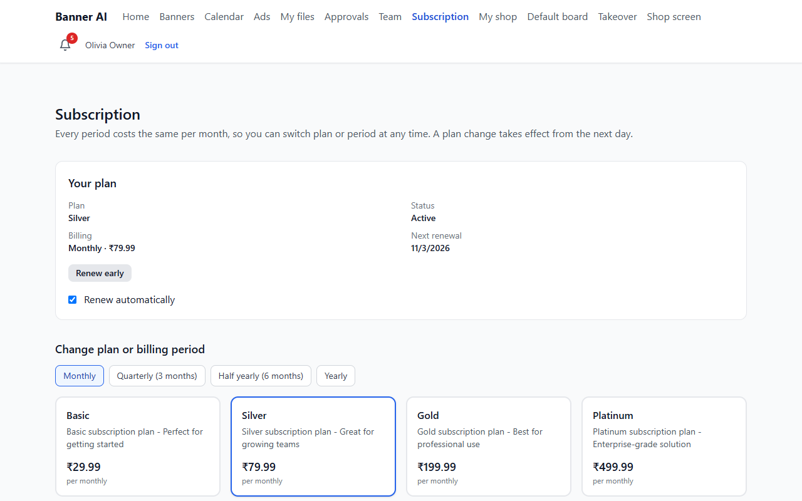

## Step 15. Your shop's details
Click **My shop → Edit**: address, **city and group**, and the **time zone** (leave it on automatic to follow your city).

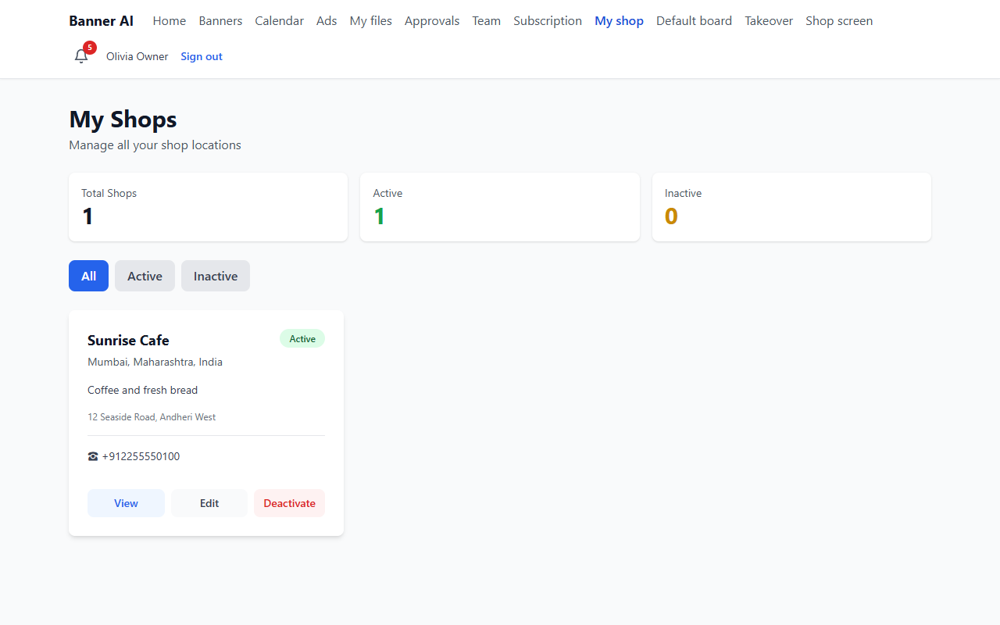

## Step 16. Messages
Click the **bell**: banners and ads waiting for you, approvals, takeover requests. Click a message to go straight to the page.

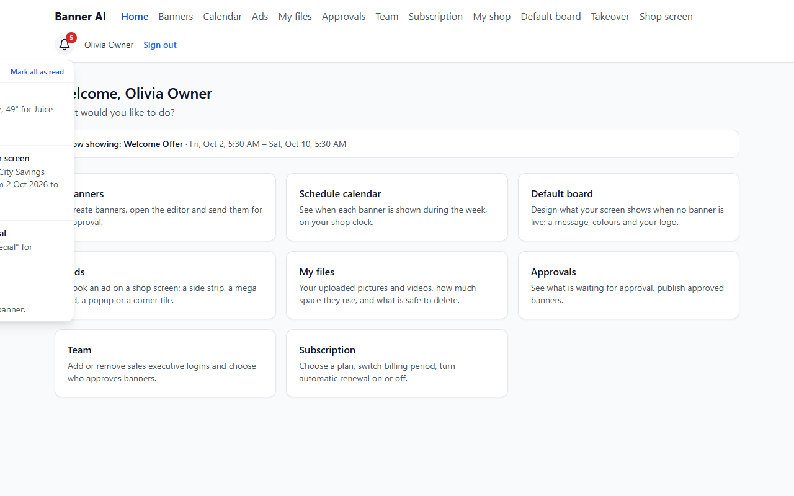

## Step 17. If a shop changes hands
Click **Takeover**. If you bought or took over a shop, you ask here with the shop's name and address; the old owner agrees with their password and chooses whether the
associates stay. Nothing changes until they agree.

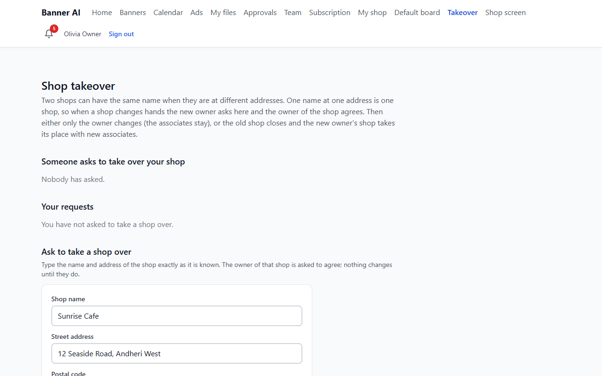

---

## You are done: what to try next
- Open the demo in a second window as **Sam** and book an ad as him: watch the bell on your side.
- Open the **administrator** window and book an ad on Sunrise Cafe: it appears on your Ads page and on the shop screen.
- Read the full [Shop Owner Guide](../shop-owner.md) for every detail.
